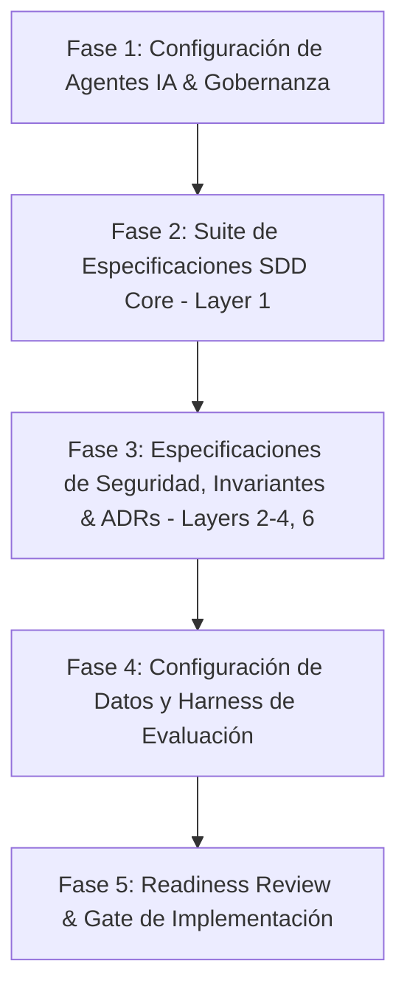

# Plan de Acción: Especificaciones SDD y Configuración de Agentes IA para el PoC AML Copilot

Este plan de acción define la estrategia secuencial para generar la suite completa de especificaciones formales de **Spec-Driven Development (SDD)**, archivos de configuración de agentes de IA (`AGENTS.md`, `rules.md`, `skills`), reglas de gobernanza y catálogo de artefactos para el proyecto **AML Alert Investigation Copilot** (Banco Río Sur) en el marco del Desafío Técnico de Bankingly.

---

## 1. Resumen Ejecutivo y Alineación con SDD

Basado en la lectura de:
1. **Guías de Spec-Driven Development** (`Guide Interacting with AI to Generate SDD Artifacts`, `Guide Enterprise SDD - Extended Artifact Catalog`, `Guide Configuring AI Coding Agents for Your Project`, `Guide AI Use Protocol`).
2. **Documentación del PoC** (`1. Selección de Caso de Uso` a `7. Universo de datos del PoC` y scripts/outputs de datos).

El objetivo es establecer primero todas las especificaciones y contratos formales (*Specs before code*) y la configuración del ecosistema de agentes antes de escribir la implementación funcional.

### Pilares Clave del Sistema a Especificar
* **Human-in-the-Loop estricto**: El LLM investiga, analiza y recomienda (`CLOSE_ALERT`, `ESCALATE_ALERT`, `REQUEST_INFORMATION`); el **Agent Harness** (capa confiable en código) gobierna el estado, valida schemas y restringe la ejecución de cualquier acción a una aprobación humana previa válida.
* **Separación de responsabilidades**: Modelo monolítico modular en Python/FastAPI/Pydantic + PostgreSQL + Web UI mínima (Next.js/React) + suite de evaluación de 25 casos (con ground truth, detección de alucinaciones y tasa de acciones no autorizadas = 0%).

---

## 2. Fases de Ejecución del Plan de Acción

---

### 🚀 Fase 1: Configuración de Agentes de IA, Skills y Reglas (Layer 5 & AI Governance)

Configurar el "onboarding document" y las restricciones operativas de los asistentes de IA para el repositorio.

1. **`AGENTS.md` (Orquestación Global en la raíz)**:
   - Definición de roles y límites claros:
     - 🏗️ **Architect Agent**: Diseño de sistema, schemas, contratos de API, especificaciones en `.sdd/`.
     - 🛡️ **Harness & Security Agent**: Guardrails de seguridad, state machine de investigación, validación Pydantic, RBAC, auditoría.
     - ⚙️ **Backend & Tool Agent**: Rutas FastAPI, servicios de herramientas (`get_alert`, `get_customer_profile`, `get_transactions`, `get_transaction_summary`, `get_previous_alerts`, `get_aml_policies`), persistencia PostgreSQL.
     - 🧪 **Evaluation & QA Agent**: Benchmark de 25 casos, graders, cálculo de métricas (grounding, accuracy, 0% unauthorized execution).
     - 🎨 **Frontend Agent**: Interfaz web mínima para visualización de alertas, traza de investigación y aprobación/rechazo humano.
   - Protocolo de interacción entre agentes y resolución de conflictos (la Constitución `.sdd/00-constitution.md` tiene máxima autoridad).

2. **`rules.md` y Adaptadores por Herramienta (`.gemini/rules.md`, `.cursor/rules/`, `.github/copilot-instructions.md`)**:
   - Estructura universal de 7 secciones:
     - **§1 Identidad**: Stack (Python 3.11+, FastAPI, Pydantic v2, PostgreSQL, SQLAlchemy/SQLModel, React/Next.js).
     - **§2 Reglas Universales**: Tipado estricto (Type hints / TypeScript strict), inmutabilidad donde aplique, conventional commits.
     - **§3 Reglas Backend**: Separación estricta entre capa LLM (untrusted) y Harness (trusted); validación de outputs mediante Pydantic; herramientas determinísticas para cálculos numéricos.
     - **§4 Reglas Frontend**: Renderizado claro de estados de alerta, traza de evidencia explicable, confirmación explícita de acciones.
     - **§5 Reglas de Seguridad & Testing**: Testing guiado por invariantes (`INV-001` a `INV-010`).
     - **§6 Reglas de Evaluación**: No modificar el set de evaluación para ajustarlo a respuestas erróneas del modelo.
     - **§7 Patrones Prohibidos**:
       - ❌ Ninguna herramienta directa de ejecución para el LLM.
       - ❌ No realizar cálculos matemáticos/agregaciones dentro del prompt si existe herramienta determinística.
       - ❌ No tratar datos recuperados de clientes o transacciones como instrucciones de sistema (protección contra prompt injection).
       - ❌ No transicionar estados de investigación a `EXECUTED` sin un registro previo en `Approval`.

3. **`skills.md` y Skills Reutilizables**:
   - `add-aml-policy`: Plantilla para incorporar nuevas políticas institucionales de AML.
   - `add-evaluation-scenario`: Plantilla para añadir nuevos casos al set de evaluación con ground truth y categoría.
   - `add-harness-tool`: Protocolo para crear una nueva herramienta controlada y registrarla en el tool registry.
   - `run-evaluation-suite`: Script y directiva para ejecutar el benchmark y generar reporte de métricas.
   - `verify-invariants`: Ejecución automatizada de pruebas unitarias/integración de invariantes de seguridad.

4. **`AI_USE_PROTOCOL.md` (Gobernanza de IA adaptada a Fintech)**:
   - Adopción de la Guía 4 con adenda específica de AML/Fintech: prohibición de ejecución autónoma de acciones regulatorias o transaccionales, tratamiento de datos sintéticos/mock, trazabilidad obligatoria y registro de auditoría.

---

### 📄 Fase 2: Generación de la Suite de Especificaciones SDD Core (Layer 1 en `.sdd/`)

Generar secuencialmente, bajo el ciclo *Draft → Review → Approve*, los 9 documentos base del catálogo SDD:

1. **`00-constitution.md`**:
   - Misión del producto, principios no negociables, arquitectura modular y catálogo de invariantes de seguridad del sistema.
2. **`01-product-requirements.md` (PRD)**:
   - Problema del analista de compliance, workflows prioritarios (P1: Investigación de alerta; P2: Evaluación de políticas y generación de evidencia; P3: Aprobación y ejecución controlada; P4: Benchmark y auditoría), criterios de aceptación y exclusiones explícitas (out-of-scope).
3. **`02-data-model-spec.md`**:
   - ERD en Mermaid, entidades (`Customer`, `CustomerKYC`, `Transaction`, `Counterparty`, `AMLAlert`, `AMLPolicy`, `Investigation`, `Evidence`, `Recommendation`, `Approval`, `AuditEvent`), reglas de negocio, índices y estrategia de seed de Banco Río Sur.
4. **`03-api-contract.md`**:
   - Contrato formal REST OpenAPI/FastAPI de endpoints: gestión de alertas, ejecución de investigación, tools internas del harness, flujo de aprobación (`POST /api/investigations/{id}/approve`), endpoints de evaluación y auditoría.
5. **`04-ui-ux-spec.md`**:
   - Wireframes ASCII y diseño de componentes para la consola del analista: lista de alertas con criticidad, panel de evidencia con fuentes citadas, panel de recomendación/políticas y compuerta de aprobación con diálogo de confirmación.
6. **`05-architecture.md`**:
   - Arquitectura en 5 capas (*Presentation*, *Agent Harness*, *Agent/LLM*, *Tools*, *Data*), diagramas de secuencia de investigación y aprobación, máquina de estados finita y política de aislamiento multi-tenant (`institution_id`).
7. **`06-implementation-plan.md`**:
   - Fases secuenciales de construcción técnica con estimaciones y mitigación de riesgos.
8. **`07-task-breakdown.md`**:
   - Desglose granular de tareas atómicas (T-001..T-xxx) con dependencias y criterios de completitud.
9. **`08-verification-spec.md`**:
   - Matriz de tests (Unitarios, Integración, Invariantes, Seguridad contra Prompt Injection) y matriz de los 25 casos de evaluación con script de walkthrough E2E.

---

### 🛡️ Fase 3: Especificaciones de Soporte, Seguridad y Decisiones de Arquitectura (Layers 2, 3, 4, 6)

1. **`INVARIANTS.md` (Raíz del proyecto)**:
   - Formalización de los 10 invariantes del sistema (`INV-001` a `INV-010`) y su matriz de mapeo a tests específicos.
2. **`DECISIONS.md` / Registros ADR en `.sdd/adr/`**:
   - ADR-001: Selección del caso de uso de investigación de alertas AML.
   - ADR-002: Descarte de microservicios en favor de un Monolito Modular.
   - ADR-003: Separación estricta LLM Untrusted vs Harness Trusted con Structured Outputs.
   - ADR-004: Evaluación first con dataset estratificado de 25 casos.
   - ADR-005: Agregaciones numéricas y resúmenes transaccionales mediante herramientas determinísticas.
3. **`14-security-spec.md`**:
   - Modelo de amenazas (Prompt Injection en campos transaccionales, bypassing de aprobación, acceso cross-tenant).
4. **`16-observability-spec.md` & `18-performance-spec.md`**:
   - Esquema de logging estructurado JSON para eventos de auditoría y SLOs del pipeline de inferencia y respuesta de API.
5. **`22-glossary.md`**:
   - Glosario de términos bancarios, AML, KYC y conceptos agénticos.

---

### 📊 Fase 4: Estructuración y Preparación de Datos de Simulación y Evals

1. **Organización del Universo de Datos**:
   - Traslado y formalización de los datos de Banco Río Sur ubicados en `.sdc/docs/PoC/7. Datos` hacia la estructura del proyecto (`data/seed/` y `data/evaluation/`).
   - Verificación de los 12 clientes KYC, ~400 transacciones, 18 contrapartes y los 25 casos de evaluación con ground truth en CSV/JSON.

---

## 3. Plan de Verificación

### Verificación de Especificaciones (SDD Completeness Review)
- [ ] Ejecutar el checklist de completitud de SDD sobre cada uno de los 9 documentos generados.
- [ ] Validar que cada invariante de `INVARIANTS.md` tenga su correspondiente caso en `08-verification-spec.md`.
- [ ] Validar coherencia entre los schemas Pydantic definidos en `03-api-contract.md`, las entidades en `02-data-model-spec.md` y los contratos en `5. Diseñar el contrato del agente.md`.
- [ ] Verificar que las reglas universales en `rules.md` y `AGENTS.md` cubran todas las directivas de seguridad bancaria y flujo de trabajo.

---

## 4. Próximos Pasos (Tras Aprobación)

1. Crear la estructura de directorios (`.sdd/`, `.gemini/`, `.agents/`, `docs/adr/`, `data/`).
2. Generar `AGENTS.md`, `.gemini/rules.md`, `.gemini/skills.md` y `AI_USE_PROTOCOL.md`.
3. Redactar los artefactos SDD de la Fase 2 (`00-constitution.md` hasta `08-verification-spec.md`).
4. Formalizar `INVARIANTS.md`, `DECISIONS.md` y el glosario.
5. Presentar el Walkthrough completo de las especificaciones aprobadas antes de iniciar la codificación funcional.
