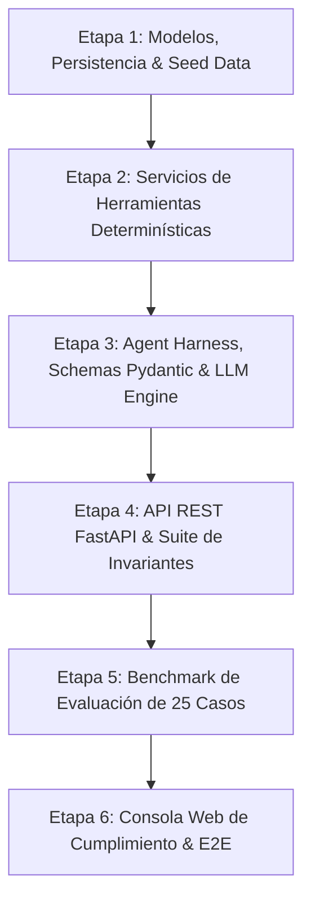

# Plan de Implementación: Fase 9 — Construcción de Código

Este plan detalla los pasos de implementación para construir el **AML Alert Investigation Copilot** siguiendo estrictamente las especificaciones aprobadas en [`.sdd/`](file:///f:/documents/bankingly-technical-challenge/.sdd/) y los invariantes de [`INVARIANTS.md`](file:///f:/documents/bankingly-technical-challenge/INVARIANTS.md).

---

## Estructura de Entregas por Etapas



---

## 1. Etapa 1: Modelos de Dominio, Persistencia y Seed Data (T-001 .. T-004)

- **[NEW] `backend/domain/models.py`**:
  - Entidades SQLAlchemy/SQLModel: `Customer`, `CustomerKYC`, `Transaction`, `Counterparty`, `AMLAlert`, `AMLPolicy`, `Investigation`, `Recommendation`, `Approval`, `AuditEvent`.
  - Tipos `Enum` para estados y decisiones (`AlertStatus`, `InvestigationStatus`, `RecommendedAction`, `ApprovalDecision`).
- **[NEW] `backend/data/database.py`**:
  - Motor de base de datos async/sync (PostgreSQL / SQLite fallback para tests sin servicios externos), gestión de sesiones y `init_db`.
- **[NEW] `backend/data/seed.py`**:
  - Ingesta estructurada de los 12 perfiles KYC de clientes, 18 contrapartes, 4 políticas AML institucionales, 12 alertas y ~400 transacciones simuladas a partir de `data/seed/aml_simulated_transactions_400.csv` y especificaciones.
- **[NEW] `tests/unit/test_persistence.py`**:
  - Verificación de inserción idempotente, relaciones foráneas y aislamiento multi-tenant (`institution_id`).

---

## 2. Etapa 2: Servicios de Herramientas Determinísticas (T-005 .. T-011)

- **[NEW] `backend/tools/schemas.py`**:
  - Modelos Pydantic v2 para inputs/outputs de las 6 herramientas de lectura (`get_alert`, `get_customer_profile`, `get_transactions`, `get_transaction_summary`, `get_previous_alerts`, `get_aml_policies`).
- **[NEW] `backend/tools/services/`**:
  - `alert_service.py`: Recuperación de alertas filtradas por `institution_id`.
  - `customer_service.py`: Consulta de perfil de cliente + historial KYC.
  - `transaction_service.py`: Consulta paginada/acotada de transacciones con límites estrictos (`max_results=500`).
  - `summary_service.py`: Cálculo determinístico de volumen total de entrada/salida, promedios, velocidad y porcentaje de cambio (`+342%`) para evitar que el LLM realice cálculos matemáticos erróneos.
  - `policy_service.py`: Consulta de políticas AML aplicables (`P-001` a `P-004`).
- **[NEW] `tests/unit/test_tools.py`**:
  - Pruebas unitarias de cálculo de resúmenes, límites de fecha y validación de tenant isolation (`INV-005`).

---

## 3. Etapa 3: Agent Harness, Schemas Pydantic & LLM Engine (T-012 .. T-020)

- **[NEW] `backend/agent/schemas.py`**:
  - `InvestigationResult`, `Finding`, `EvidenceReference`, `RecommendationSummary` con validación estricta de enums.
- **[NEW] `backend/agent/prompt_engine.py`**:
  - Prompt del sistema con encapsulación de datos externos en tags `<data>` inertes para neutralizar ataques de Prompt Injection (`INV-006`).
- **[NEW] `backend/agent/llm_client.py`**:
  - Abstracción de proveedor LLM: Soporte para Ollama, OpenAI, Gemini y un Mock Provider determinístico para testing continuo y evaluación offline.
- **[NEW] `backend/harness/`**:
  - `tool_registry.py`: Registro exclusivo de herramientas de lectura (sin herramientas de ejecución para el LLM - `INV-001`).
  - `orchestrator.py`: Bucle de investigación autónoma controlada: recepción de alerta → llamada a herramientas → observación → síntesis estructurada.
  - `validator.py`: Validador de salida Pydantic con reintentos controlados (máx 2) y fallback seguro (`INV-009`).
  - `state_machine.py`: Máquina de estados finita que prohíbe saltar de `RECOMMENDATION_READY` a `EXECUTED`.
  - `approval_gate.py`: Verificador criptográfico/de sesión de aprobación humana previa (`INV-002`, `INV-003`, `INV-004`).
  - `audit_service.py`: Registro inmutable de eventos en `AuditEvent`.
- **[NEW] `tests/security/test_invariants.py`**:
  - Suite de pruebas de seguridad para los 10 Invariantes (`INV-001` a `INV-010`).

---

## 4. Etapa 4: API REST FastAPI & Endpoints (T-021 .. T-023, T-027)

- **[NEW] `backend/main.py`**:
  - Aplicación FastAPI con middlewares de CORS, headers de tenant (`X-Institution-Id`), manejo estructurado de errores y Swagger UI.
- **[NEW] `backend/api/`**:
  - `alerts.py`: Endpoints de listado y detalle de alertas.
  - `investigations.py`: Endpoint `POST /api/v1/investigations/start` y detalle de investigación.
  - `decisions.py`: Endpoints `POST /api/v1/investigations/{id}/decide` y `POST /api/v1/investigations/{id}/execute`.
- **[NEW] `tests/integration/test_api_endpoints.py`**:
  - Pruebas HTTP de extremo a extremo para todos los endpoints de la API.

---

## 5. Etapa 5: Suite de Evaluación Benchmark (T-024 .. T-026)

- **[NEW] `backend/evaluation/`**:
  - `dataset.py`: Cargador de los 25 casos de prueba de `data/evaluation/aml_evaluation_ground_truth_25.csv`.
  - `graders.py`: Evaluadores automatizados para Recommendation Accuracy, Evidence Grounding, Missing Information Detection y Unauthorized Action Rate.
  - `runner.py`: Ejecutor del benchmark con generación de reporte JSON y cálculo de métricas.
- **[NEW] `tests/evaluation/test_benchmark.py`**:
  - Test automatizado que valida que el **Unauthorized Action Rate sea estrictamente 0.0%** y la precisión supere los umbrales de la especificación.

---

## 6. Etapa 6: Consola Web de Cumplimiento & Verificación E2E (T-028 .. T-033)

- **[NEW] `frontend/`**:
  - Interfaz web interactiva del analista de compliance (React):
    - Cola de alertas con badges de riesgo.
    - Espacio de trabajo de investigación con trazas de evidencia clicables.
    - Modal de decisión y confirmación de aprobación/rechazo.
- **[NEW] `tests/e2e/test_walkthrough.py`**:
  - Script automatizado del escenario E2E completo (`AML-00127` / Martín Pereira).

---

## Plan de Verificación

### Pruebas Automatizadas
```bash
# 1. Tests unitarios y de persistencia
pytest tests/unit/ -v

# 2. Tests de invariantes de seguridad (INV-001 a INV-010)
pytest tests/security/test_invariants.py -v

# 3. Tests de integración de API
pytest tests/integration/test_api_endpoints.py -v

# 4. Benchmark de 25 casos de evaluación
python -m backend.evaluation.runner
pytest tests/evaluation/test_benchmark.py -v
```

### Verificación Manual
- Ejecución del servidor FastAPI (`uvicorn backend.main:app --reload`) e inspección visual de la consola web del analista y del log de auditoría.
