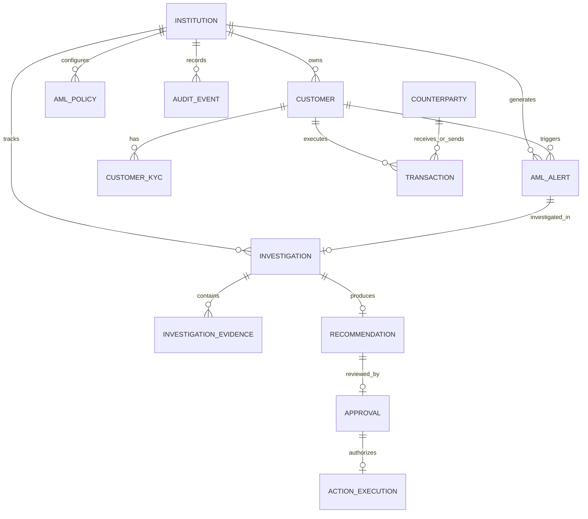

# 🗄️ 02 — Data Model Specification

> **Project:** AML Alert Investigation Copilot  
> **Database:** PostgreSQL (async SQLAlchemy / SQLModel)  
> **Tenant Strategy:** Mandatory `institution_id` on all tenant entities

---

## 1. Entity-Relationship Diagram (ERD)

---

## 2. Enumerations

### `AlertStatus`
- `OPEN`: Alert generated by monitoring, pending investigation.
- `UNDER_INVESTIGATION`: Investigation active in Copilot.
- `CLOSED_FALSE_POSITIVE`: Alert dismissed as legitimate activity.
- `ESCALATED_SAR`: Escalated for Suspicious Activity Report (SAR) filing.
- `INFO_REQUESTED`: Additional documentation requested from branch/customer.

### `InvestigationStatus`
- `CREATED`: Investigation record initialized.
- `INVESTIGATING`: Agent actively calling tools and compiling evidence.
- `RECOMMENDATION_READY`: Structured output generated and schema-validated.
- `AWAITING_APPROVAL`: Pending compliance analyst decision.
- `APPROVED`: Human analyst confirmed recommended action.
- `REJECTED`: Human analyst overturned recommendation with alternate decision.
- `EXECUTED`: Final action committed to alert and audit log.
- `INVESTIGATION_FAILED`: Schema retry exceeded or technical failure.

### `RecommendedAction`
- `CLOSE_ALERT`: Recommendation to dismiss alert.
- `ESCALATE_ALERT`: Recommendation to elevate to senior compliance / SAR.
- `REQUEST_INFORMATION`: Recommendation to seek supporting documents.

### `ApprovalDecision`
- `APPROVED`: Analyst agrees with Copilot recommendation.
- `REJECTED`: Analyst rejects Copilot recommendation.
- `OVERRIDDEN`: Analyst chooses a different action.

---

## 3. Entity Details & Schema Definitions

### 3.1 `customers`
| Column | Type | Constraints | Description |
|---|---|---|---|
| `id` | `VARCHAR(64)` | `PRIMARY KEY` | E.g. `CUST-0042` |
| `institution_id` | `VARCHAR(64)` | `NOT NULL, INDEX` | E.g. `BANK-RIO-SUR` |
| `name` | `VARCHAR(255)` | `NOT NULL` | Full customer name |
| `customer_type` | `VARCHAR(32)` | `NOT NULL` | `INDIVIDUAL` or `BUSINESS` |
| `country` | `VARCHAR(64)` | `NOT NULL` | Country of residence / incorporation |
| `created_at` | `TIMESTAMP WITH TZ`| `NOT NULL` | Account opening timestamp |

### 3.2 `customer_kyc`
| Column | Type | Constraints | Description |
|---|---|---|---|
| `id` | `VARCHAR(64)` | `PRIMARY KEY` | E.g. `KYC-0042` |
| `customer_id` | `VARCHAR(64)` | `NOT NULL, FK(customers.id)` | Target customer |
| `institution_id` | `VARCHAR(64)` | `NOT NULL` | Institution scope |
| `occupation` | `VARCHAR(255)` | `NOT NULL` | Primary occupation / business activity |
| `declared_monthly_income` | `DECIMAL(14,2)` | `NOT NULL` | Declared income (USD) |
| `declared_source_of_funds`| `VARCHAR(255)` | `NOT NULL` | Declared funds source |
| `risk_level` | `VARCHAR(32)` | `NOT NULL` | `LOW`, `MEDIUM`, `HIGH` |
| `kyc_status` | `VARCHAR(32)` | `NOT NULL` | `VERIFIED`, `EXPIRED`, `PENDING` |
| `notes` | `TEXT` | `NULLABLE` | Secondary activities, special notes |
| `verified_at` | `TIMESTAMP WITH TZ`| `NOT NULL` | Last KYC verification date |

### 3.3 `counterparties`
| Column | Type | Constraints | Description |
|---|---|---|---|
| `id` | `VARCHAR(64)` | `PRIMARY KEY` | E.g. `CP-0012` |
| `institution_id` | `VARCHAR(64)` | `NOT NULL` | Scope |
| `name` | `VARCHAR(255)` | `NOT NULL` | Counterparty name |
| `country` | `VARCHAR(64)` | `NOT NULL` | Jurisdiction |
| `industry` | `VARCHAR(128)` | `NULLABLE` | Industry / sector |
| `risk_level` | `VARCHAR(32)` | `NOT NULL` | `LOW`, `MEDIUM`, `HIGH` |

### 3.4 `transactions`
| Column | Type | Constraints | Description |
|---|---|---|---|
| `id` | `VARCHAR(64)` | `PRIMARY KEY` | E.g. `TX-10023` |
| `institution_id` | `VARCHAR(64)` | `NOT NULL, INDEX` | Institution scope |
| `customer_id` | `VARCHAR(64)` | `NOT NULL, FK(customers.id), INDEX` | Primary customer |
| `counterparty_id` | `VARCHAR(64)` | `NULLABLE, FK(counterparties.id)` | Counterparty |
| `direction` | `VARCHAR(16)` | `NOT NULL` | `INCOMING` or `OUTGOING` |
| `amount` | `DECIMAL(14,2)` | `NOT NULL` | Transaction amount |
| `currency` | `VARCHAR(3)` | `NOT NULL` | `USD` / `UYU` |
| `tx_type` | `VARCHAR(64)` | `NOT NULL` | `WIRE_TRANSFER`, `INTERNAL_TRANSFER`, etc. |
| `timestamp` | `TIMESTAMP WITH TZ`| `NOT NULL, INDEX` | Execution timestamp |
| `description` | `TEXT` | `NOT NULL` | Raw memo / description (treated as inert data) |

### 3.5 `aml_alerts`
| Column | Type | Constraints | Description |
|---|---|---|---|
| `id` | `VARCHAR(64)` | `PRIMARY KEY` | E.g. `AML-00127` |
| `institution_id` | `VARCHAR(64)` | `NOT NULL, INDEX` | Scope |
| `customer_id` | `VARCHAR(64)` | `NOT NULL, FK(customers.id)` | Target customer |
| `alert_type` | `VARCHAR(128)` | `NOT NULL` | E.g. `UNUSUAL_TRANSACTION_PATTERN` |
| `trigger_reason` | `TEXT` | `NOT NULL` | Automated rule trigger description |
| `risk_score` | `INTEGER` | `NOT NULL` | 0–100 score |
| `status` | `VARCHAR(32)` | `NOT NULL, DEFAULT 'OPEN'` | `AlertStatus` enum |
| `created_at` | `TIMESTAMP WITH TZ`| `NOT NULL` | Trigger timestamp |

### 3.6 `aml_policies`
| Column | Type | Constraints | Description |
|---|---|---|---|
| `id` | `VARCHAR(64)` | `PRIMARY KEY` | E.g. `P-001` |
| `institution_id` | `VARCHAR(64)` | `NOT NULL` | Scope |
| `category` | `VARCHAR(64)` | `NOT NULL` | `VELOCITY`, `KYC_MATCH`, `HIGH_RISK_CP` |
| `title` | `VARCHAR(255)` | `NOT NULL` | Policy title |
| `description` | `TEXT` | `NOT NULL` | Rule condition & mandatory action |
| `severity` | `VARCHAR(32)` | `NOT NULL` | `LOW`, `MEDIUM`, `HIGH`, `CRITICAL` |

### 3.7 `investigations`
| Column | Type | Constraints | Description |
|---|---|---|---|
| `id` | `VARCHAR(64)` | `PRIMARY KEY` | E.g. `INV-2026-001` |
| `institution_id` | `VARCHAR(64)` | `NOT NULL` | Scope |
| `alert_id` | `VARCHAR(64)` | `NOT NULL, UNIQUE, FK(aml_alerts.id)` | Single investigation per alert |
| `analyst_id` | `VARCHAR(64)` | `NOT NULL` | Analyst who launched investigation |
| `status` | `VARCHAR(32)` | `NOT NULL` | `InvestigationStatus` enum |
| `summary` | `TEXT` | `NULLABLE` | Executive summary generated by Copilot |
| `risk_assessment` | `VARCHAR(32)` | `NULLABLE` | `LOW`, `MEDIUM`, `HIGH`, `CRITICAL` |
| `confidence_score` | `DECIMAL(3,2)` | `NULLABLE` | 0.00–1.00 score |
| `created_at` | `TIMESTAMP WITH TZ`| `NOT NULL` | Start timestamp |
| `completed_at` | `TIMESTAMP WITH TZ`| `NULLABLE` | Completion timestamp |

### 3.8 `recommendations`
| Column | Type | Constraints | Description |
|---|---|---|---|
| `id` | `VARCHAR(64)` | `PRIMARY KEY` | E.g. `REC-001` |
| `investigation_id` | `VARCHAR(64)` | `NOT NULL, UNIQUE, FK(investigations.id)` | Parent investigation |
| `action` | `VARCHAR(32)` | `NOT NULL` | `CLOSE_ALERT`, `ESCALATE_ALERT`, `REQUEST_INFORMATION` |
| `rationale` | `TEXT` | `NOT NULL` | Detailed explanation |
| `findings` | `JSONB` | `NOT NULL` | List of finding objects with evidence refs |
| `missing_information`| `JSONB` | `NOT NULL` | Array of missing data strings |
| `applicable_policies`| `JSONB` | `NOT NULL` | Array of policy IDs cited |
| `limitations` | `JSONB` | `NOT NULL` | Array of recognized analytical limitations |
| `created_at` | `TIMESTAMP WITH TZ`| `NOT NULL` | Timestamp |

### 3.9 `approvals`
| Column | Type | Constraints | Description |
|---|---|---|---|
| `id` | `VARCHAR(64)` | `PRIMARY KEY` | E.g. `APP-001` |
| `recommendation_id` | `VARCHAR(64)` | `NOT NULL, UNIQUE, FK(recommendations.id)` | Approved recommendation |
| `analyst_id` | `VARCHAR(64)` | `NOT NULL` | Authorized analyst |
| `decision` | `VARCHAR(32)` | `NOT NULL` | `ApprovalDecision` |
| `notes` | `TEXT` | `NULLABLE` | Human analyst comment |
| `created_at` | `TIMESTAMP WITH TZ`| `NOT NULL` | Timestamp |

### 3.10 `audit_events`
| Column | Type | Constraints | Description |
|---|---|---|---|
| `id` | `VARCHAR(64)` | `PRIMARY KEY` | E.g. `AUD-9001` |
| `institution_id` | `VARCHAR(64)` | `NOT NULL, INDEX` | Scope |
| `investigation_id` | `VARCHAR(64)` | `NULLABLE, INDEX` | Related investigation |
| `actor_type` | `VARCHAR(32)` | `NOT NULL` | `AGENT`, `ANALYST`, `SYSTEM_HARNESS` |
| `actor_id` | `VARCHAR(64)` | `NOT NULL` | Identity |
| `event_type` | `VARCHAR(64)` | `NOT NULL` | `TOOL_CALLED`, `RECOMMENDATION_GENERATED`, `APPROVAL_GRANTED`, `ACTION_EXECUTED` |
| `payload` | `JSONB` | `NOT NULL` | Event details / parameters / diffs |
| `created_at` | `TIMESTAMP WITH TZ`| `NOT NULL` | Timestamp |

---

## 4. Seed Strategy & Universe

- **Institution:** Banco Río Sur (`BANK-RIO-SUR`).
- **Customers:** 12 stratified synthetic profiles (Baseline, Legitimate Unusual, High Risk, Incomplete KYC, Contradictory).
- **Counterparties:** 18 domestic & international entities with varied risk classifications.
- **Transactions:** ~400 coherent transactions covering a 6-month historical baseline and anomaly periods.
- **Policies:** 4 internal AML policies (`P-001` to `P-004`).
- **Alerts:** 12 simulated alerts.
