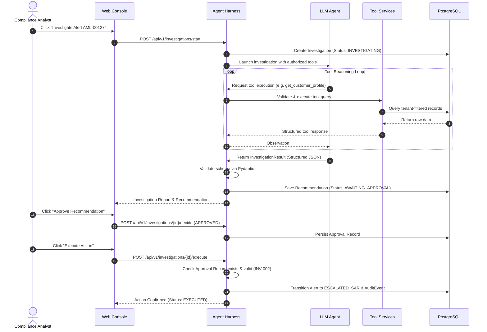
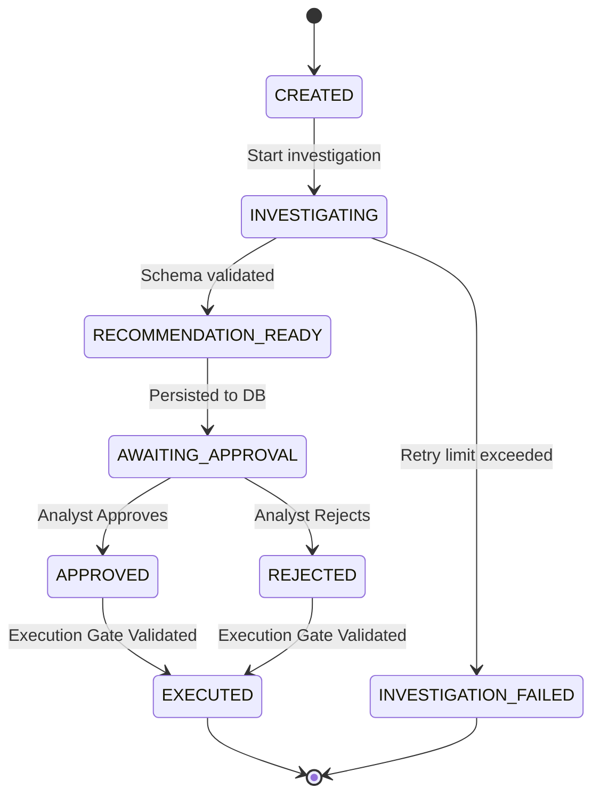

# 🏛️ 05 — Architecture Specification

> **Pattern:** 5-Layer Modular Monolith  
> **Backend:** Python 3.11+, FastAPI, Pydantic v2, PostgreSQL  
> **Boundary Model:** Trusted Application Harness vs. Untrusted Probabilistic LLM

---

## 1. Five-Layer Architecture Diagram

```mermaid
graph TD
    subgraph Layer 1: Presentation
        UI[Web Compliance Console - React/Next.js]
    end

    subgraph Layer 2: API & Agent Harness (TRUSTED)
        API[FastAPI Endpoints]
        Harness[Agent Harness Orchestrator]
        State[State Machine & Lifecycle Manager]
        Val[Pydantic Schema Validator]
        Gate[Human Approval Gate]
        Audit[Audit Logger]
    end

    subgraph Layer 3: Agent & LLM (UNTRUSTED)
        Agent[AML Investigation Agent]
        Prompt[Investigation Prompt Engine]
        LLM[LLM Provider - Ollama/OpenAI/Gemini]
    end

    subgraph Layer 4: Tool Services
        T1[get_alert]
        T2[get_customer_profile]
        T3[get_transactions]
        T4[get_transaction_summary]
        T5[get_previous_alerts]
        T6[get_aml_policies]
    end

    subgraph Layer 5: Data & Persistence
        DB[(PostgreSQL Database)]
        Repo[SQLAlchemy Repositories]
    end

    UI -->|REST / JSON| API
    API --> Harness
    Harness --> State
    Harness --> Val
    Harness --> Gate
    Harness --> Audit
    
    Harness -->|Goal & Tool Defs| Agent
    Agent --> Prompt
    Prompt --> LLM
    LLM -->|Tool Requests| Harness
    
    Harness -->|Execute Authorized Read Tools| T1 & T2 & T3 & T4 & T5 & T6
    T1 & T2 & T3 & T4 & T5 & T6 --> Repo
    Repo --> DB
    
    Gate -->|Execute Approved Action| Repo
    Audit --> Repo
```

---

## 2. Investigation Sequence Flow



---

## 3. Investigation State Machine



> **Critical Safety Guarantee:** There is **NO direct transition** from `RECOMMENDATION_READY` to `EXECUTED`. The system architecture forces all paths through `AWAITING_APPROVAL` and human confirmation.

---

## 4. Complete Project Directory Structure

```
aml-alert-investigation-copilot/
├── AGENTS.md                          # Global agent orchestration
├── INVARIANTS.md                      # Formal system invariants
├── AI_USE_PROTOCOL.md                 # AI governance in banking
├── README.md                          # Project overview & running instructions
│
├── .gemini/                           # Gemini & Antigravity configuration
│   ├── rules.md
│   ├── skills.md
│   └── settings.json
│
├── .github/                           # Copilot configuration & CI
│   ├── copilot-instructions.md
│   └── workflows/ci.yml
│
├── .cursor/                           # Cursor AI configuration
│   └── rules/aml-copilot.mdc
│
├── .sdd/                              # SDD Specifications (Layer 1-6)
│   ├── README.md
│   ├── 00-constitution.md
│   ├── 01-product-requirements.md
│   ├── 02-data-model-spec.md
│   ├── 03-api-contract.md
│   ├── 04-ui-ux-spec.md
│   ├── 05-architecture.md
│   ├── 06-implementation-plan.md
│   ├── 07-task-breakdown.md
│   ├── 08-verification-spec.md
│   ├── 09-git-strategy.md
│   ├── 10-cicd-pipeline.md
│   ├── 14-security-spec.md
│   ├── 16-observability-spec.md
│   ├── 18-performance-spec.md
│   ├── 22-glossary.md
│   └── adr/                           # Architecture Decision Records
│
├── backend/                           # Python FastAPI Application
│   ├── api/                           # FastAPI routers
│   ├── harness/                       # Agent Harness & State Machine
│   ├── agent/                         # LLM prompt engine & schemas
│   ├── tools/                         # Tool services & contracts
│   ├── domain/                        # Domain models & entities
│   ├── repositories/                  # SQLAlchemy / SQLModel persistence
│   └── evaluation/                    # Eval runner, graders & metrics
│
├── frontend/                          # React / Next.js Compliance Console
│   └── src/
│
├── data/                              # Datasets
│   ├── seed/                          # Banco Río Sur baseline universe
│   └── evaluation/                    # 25-case stratified benchmark
│
└── tests/                             # Test Suites
    ├── unit/                          # Unit tests (Harness, Tools, Schemas)
    ├── integration/                   # API endpoint integration tests
    ├── security/                      # Invariant tests (INV-001..INV-010)
    └── evaluation/                    # Benchmark execution tests
```
