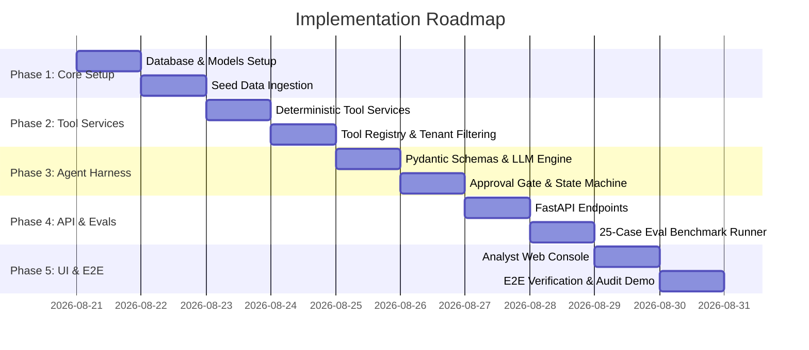

# 📅 06 — Implementation Plan

> **Project:** AML Alert Investigation Copilot  
> **Methodology:** Spec-Driven Development (Phase 9 Execution)  
> **Strategy:** Phased Incremental Delivery with Continuous Quality Gates

---

## 1. Implementation Phases & Milestones

---

## 2. Detailed Phase Breakdown

### Phase 1: Domain & Persistence Foundation
- **Goal:** Establish PostgreSQL schema, migrations, domain models, and load Banco Río Sur simulated seed universe.
- **Key Deliverables:** SQLAlchemy models in `backend/domain/` and seed script in `backend/data/seed.py`.
- **Quality Gate:** Database tables created, constraints active, and seed queries successfully verified.

### Phase 2: Tool Services & Isolation
- **Goal:** Implement the 6 read-only tool services with deterministic calculations (`get_transaction_summary`) and tenant scoping.
- **Key Deliverables:** Service modules in `backend/tools/services/` and unit test coverage in `tests/unit/test_tools.py`.
- **Quality Gate:** 100% unit test pass rate; verified that `institution_id` cannot be bypassed.

### Phase 3: Agent Harness & Security Boundary
- **Goal:** Implement LLM client abstraction, Pydantic `InvestigationResult` validation, prompt injection defense, and the state machine approval gate.
- **Key Deliverables:** `backend/harness/` orchestrator, validator, and approval gate.
- **Quality Gate:** `INV-001` (No autonomous action) and `INV-002` (Mandatory human approval) automated tests passing.

### Phase 4: REST API & Evaluation Suite
- **Goal:** Expose FastAPI routes and build the evaluation benchmark runner for the 25 stratified scenarios.
- **Key Deliverables:** `backend/api/` routers and `backend/evaluation/` benchmark engine with reporting.
- **Quality Gate:** Evaluation runner outputs metrics: Accuracy, Evidence Grounding, and 0% Unauthorized Action Rate.

### Phase 5: Compliance Web Console & E2E Walkthrough
- **Goal:** Build the React/Next.js console, connect to API, and conduct the end-to-end walkthrough.
- **Key Deliverables:** Frontend views in `frontend/src/` and verified E2E demo flow.
- **Quality Gate:** Complete E2E walkthrough script passing with full audit trail generated.
